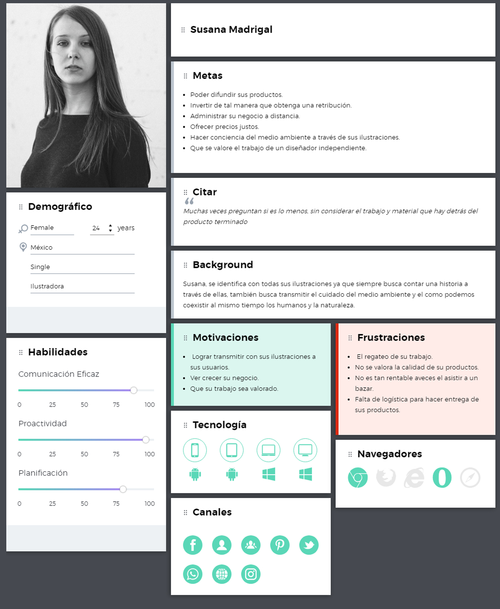
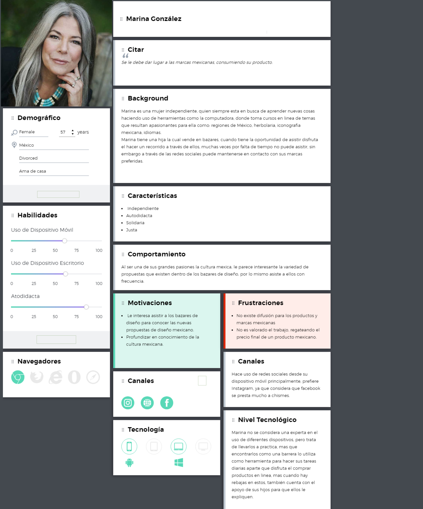
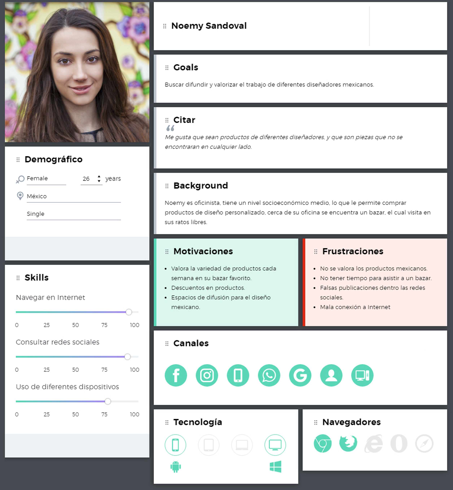
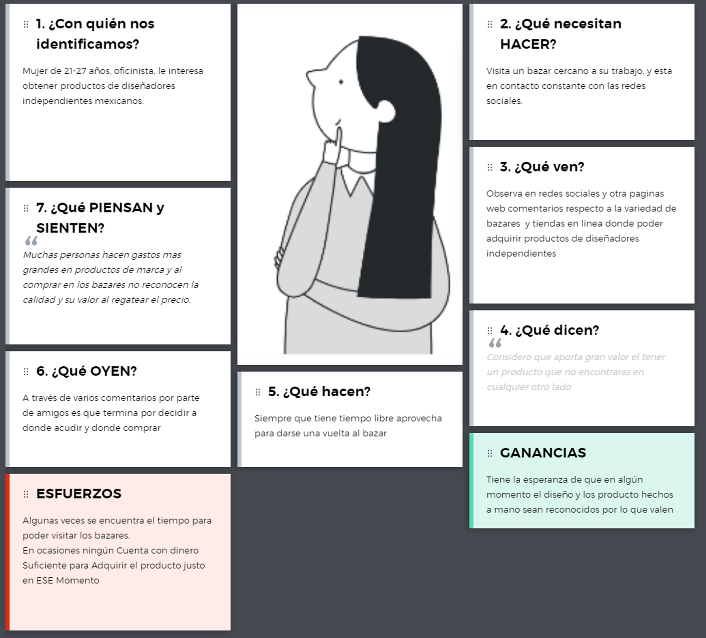
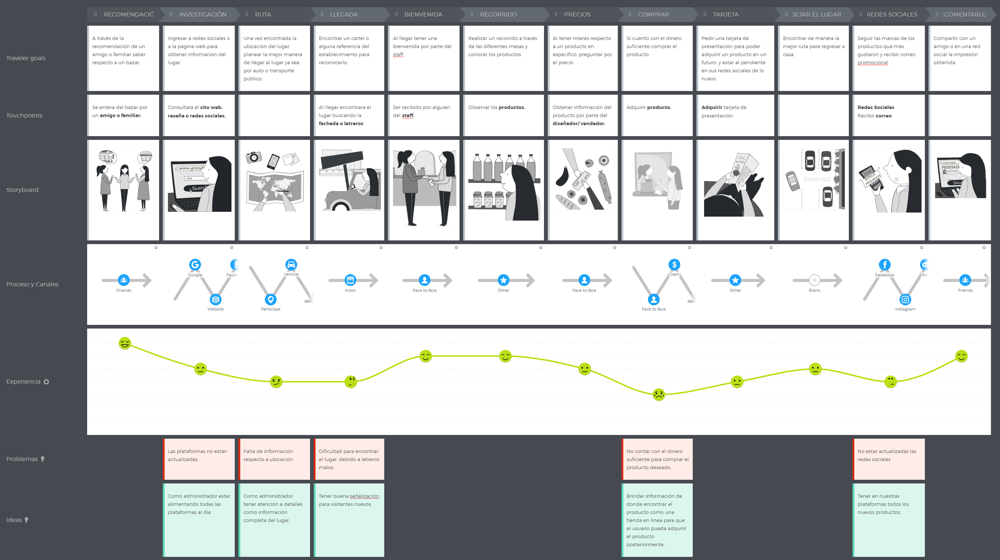
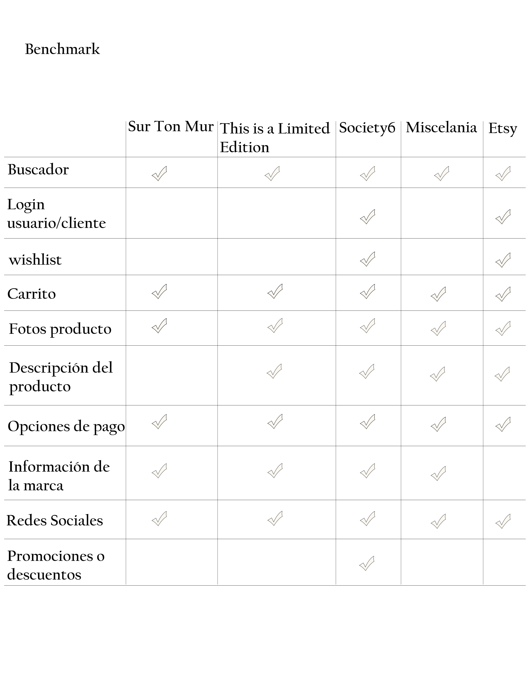
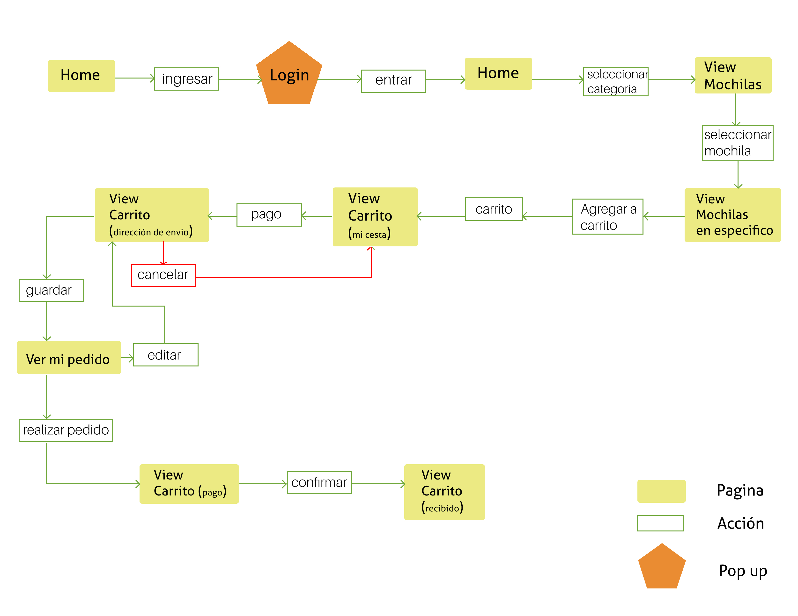
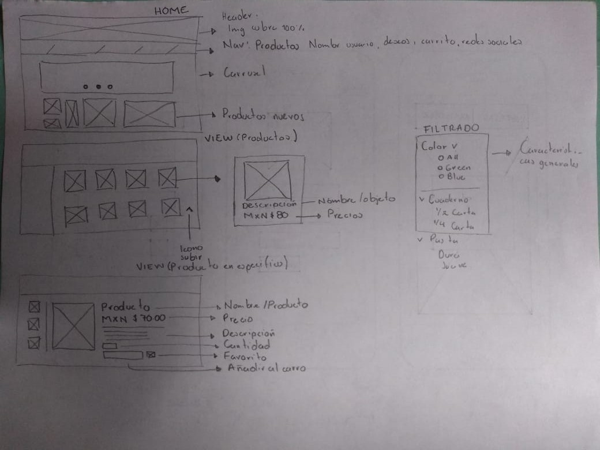
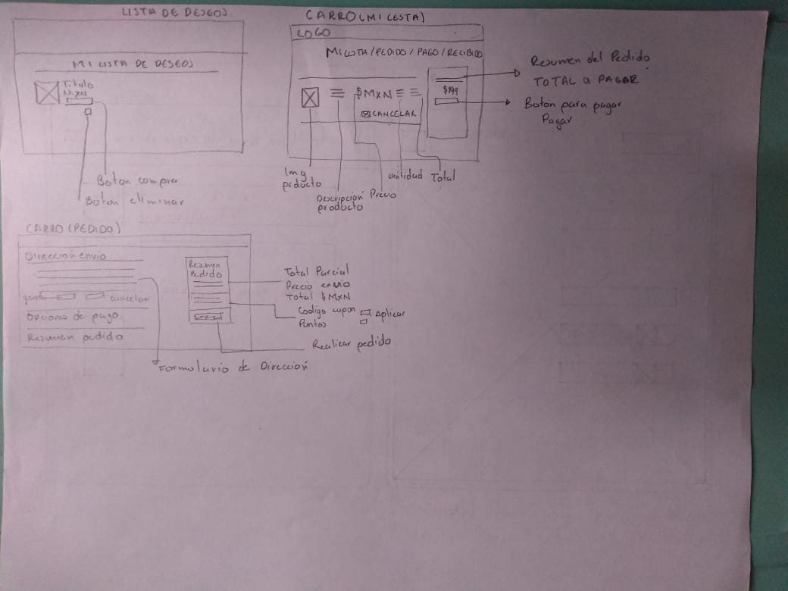

# E - C O M M E R C E
 Negocio a enfocar - Cliente
====================
## Introducción

Fania es una micro empresa que dio inicio en enero del 2016, en un principio como un proyecto personal por parte de Yaritza, ella como ilustradora quería promover todo su material visual (ilustraciones) posteriormente lo plasmo en diferentes soportes (mochilas, bolsas, libretas, etc) creciendo este gran proyecto empezó a ganar atención.

Sus temáticas están relacionadas con la naturaleza y animales, hace uso de colores claros y neutros.

Los bazares de diseño fueron una gran impulso, posteriormente las redes sociales, con las cuales se dio a conocer de mayor manera, ya que tambien le ayudaron como intermediario en ventas.

## Catalogo

Pain Points
====================
Uno de los principales recursos que utiliza la marca Fania para vender los productos y darlos a conocer es a través de los diferentes bazares de diseño que se llegan a organizar dentro de La Ciudad de México, se debe mencionar que el asistir a uno de estos eventos implica gastos como el pagar un lugar lo cual muchas veces no es rentable, pero tras el último temblor sucedido el año pasado las zonas donde se daba lugar los bazares de diseño quedaron afectadas provocando que estos quedaran suspendidos por un tiempo.

Posteriormente la marca Fania hizo uso de diferentes redes sociales como “Facebook” y “Twitter” para difundir todo sus productos con una cantidad considerable de seguidores, Facebook 4755 seguidores y Twitter, sirviendo como intermediario estas redes para poder vender algunos productos, pero muchas veces resulta complicado ya que el proceso es hacer las entregas en alguna estación del metro, también a la par este tipo de entregas de producto causa desconfianza tanto para el cliente como usuario.

-	Sin bazares de diseño a los cuales acudir, se limitaba a la marca Fania a ofrecer sus productos ya que no cuenta con un lugar fijo donde poder venderlos.
-	En ocasiones resultaba poco rentable el asistir a los bazares de diseño ya que no se obtenían suficientes ganancias
-	El hacer uso de las redes sociales como un intermediario para entregar los productos resulta complicado en ocasiones en cuestión de logística, y más aparte los productos no pueden mostrarse en fotografías de alta calidad.

Objetivos
====================
A través de la implementación de una e-commerce a esta microempresa se fortalecerá de la siguiente manera:
- Obtener los productos de la marca si necesidad de asistir a un lugar en específico.
- Dar difusión a la marca sin depender solo de los eventos de bazares.
- Tener acceso a los productos en cualquier momento.
- Brindar mayor confianza tanto cliente – usuario al momento de ejecutar un pedido – venta.
- Evitar intermediarios durante una venta

Usuario
====================
Para conocer y tener un acercamiento de los principales clientes de Fania, se visitó un bazar de diseño “Fusión, casa de diseñadores” en el cual se realizaron entrevistas, el objetivo de estas fue el siguiente:

-	Conocer cuál es la razón por la cual visitan el bazar de Diseño.
-	Cuáles son sus intereses al realizar su visita.
-	Cuáles son sus expectativas.
-	Como consideran su experiencia tras haber visitado el bazar.
-	Cual es medio por el que se enteraron del bazar.
-	En caso de haber realizdo una compra, que piensa respecto a los precios.
-	Tienen algún tipo de seguimiento con alguna marca de su interés a través de redes sociales.

Tras haber realizado las preguntas anteriores se obtuvo la siguiente data:

### Puntos de contacto con el lugar

**Recomendación:** El 70 % de los encuestados conocieron del lugar a través de un amigo o familiar, para posteriormente ellos recomendar el lugar y convertirse en un visitante frecuente, ya que el bazar ofrece cada semana nuevos productos lo cual asegura que siempre abra algo nuevo o diferente.

**Redes Sociales:**  El otro 30% de los encuestados conocieron del lugar a través de las redes sociales, ya que ellos están en constante búsqueda de nuevos bazares de diseño que visitar, lo consideran como un hobbie.

### Motivo de la visita

**Conocer** las marcas independientes y sus productos.

**Obtener** productos personalizados.

**Familiarizarse** con  las nuevas propuestas independientes de diseñadores mexicanos.

**Curiosidad** respecto al lugar.

**Descubrir** inspiración.

**Apoyar** el talento mexicano.

### Seguimiento de la marca:
El 70% comento que suele buscar a través de las redes sociales las marcas de su interés para estar al día con lo nuevo que se llegue a subir y también para conocer si hay algún tipo de descuento.

Pain Points
====
Base a la experiencia de estos usuarios se identificaron los siguientes pain points:
### Incomodidad
 Aunque disfrutan visitar el bazar, en ocasiones está demasiado lleno lo cual no les hace sentir a gusto y ver lo productos con la comodidad que quisieran.
También se sienten invadidos por los vendedores, al insistirles el que pruebe o se acerquen para ver su producto.
### Precios Altos
Muchas veces el producto es de su agrado, pero se encuentran con precios muy altos o también no estaban preparados para una compra, por lo cual no cuentan con el dinero necesario para realizar su compra en ese momento.
### Falta de tiempo
Muchas veces van con el tiempo contado o justo lo cual provoca que no puedan ver los productos como quisieran.

Posteriormente se realizó una encuesta específicamente para usuarios de la marca Fania, con la intención de conocer su interés respecto a la compra online e identificar que elementos les brinda confianza, y saber si ellos accederían a comprar productos de la marca online. 

**Rango de edad**

18 – 49 años

**Sexo**

89.8 % mujeres

10.2 % hombres

**Frecuencia con la que realizan compras online**

33.9% Dos a tres veces al mes.

27.7% Una vez al mes.

15.3% Más de cinco veces al mes.

**Tipo de producto que suelen comprar online**

Ropa, Electrónico, Productos de diseñadores mexicanos, Zapatos, Libros, Accesorios, Bolsas y Mochilas.

La minoría respondió que comida y súper.

**Razón por la que compran en línea**

 Mejores precios:

Un 35% menciono que prefería comprar online porque muchas veces los productos tienen un mejor precio, más aparte en ocasiones hay una serie de promociones las cuales los anima a realizar las compras, de hecho hay usuarios que solo están al pendiente de las ofertas del mes.

Comodidad:

Un 40% menciona que les resulta más cómodo por varios aspectos como:

El no tener que trasladarte de un lugar a otro, no dedicar tiempo al mismo traslado, se evitan el salir de su casa, puede tomarse el tiempo necesario para poder observar los productos y decidirse, se evita el interactuar con vendedores, muchas veces la tienda física está a una distancia considerable.

Variedad de productos:

Un 28% menciona que en tiendas físicas en ocasiones no hay el producto, en otras ocasiones solo se vende en online, y otras tantas hay más variedad de productos.

Valor agregado:

El resto comentaba que era porque prefería realizar sus pagos con tarjeta, también prefieren el leer comentarios o reseñas de productos, y que también cuando les llegaba el paquete era como una gran experiencia ya que lo sentían como un autorregalo y es un disfrute el abrirlo.

Plataformas que utilizan para realizar su compra online:

    32%  Amazon
    20% Mercado Libre
    23% Kichink
    15% Facebook
    5%  ebay
    3% Etsy
    2% Steam

Factores que brindan confianza:

    Comentarios / reseñas.
    Calidad en las fotografías del producto, un buen diseño del sitio.
    Reputación de la marca y el vendedor.
    Opciones de pago (efectivo, no solo tarjeta).
    Previo contacto con el producto en físico.
    Rastreo de la compra.

Dispositivo desde el cual realizan su compra:

    46.9 % Escritorio
    42.2 % Móvil.
    6.3 % Tableta.

### Resultados de encuesta
https://docs.google.com/forms/d/1XBGI9p6pgl88cQ3D4MRkShs33CypWE4qnYF65Xr5GGw/edit#responses

### Guia de Entrevistas
https://drive.google.com/open?id=1JAHkb1hshGJb22rXUY9C90SAgAOJ_Qsp

User Personas
====================
### Cliente

### Usuario

### Empaty map

Coustomer Journey Map
====================

Propuesta
====================
Base a toda la data recabada desde nuestro cliente “Fania” y sus usuarios se propone lo siguiente:

- Se propone realizar un e- commerce, ya que este tendrá un valor agregado tanto para el cliente “Fania” como al usuario, no se busca sustituir la experiencia de un bazar ni evitar la asistencia del cliente en este último, sino que un e-commerce reforzara el nicho de usuarios que ya se tiene y se aspira a que este aumente. 

- Se considera que el e-commerce y la asistencia a un bazar se complementaran ya que un porcentaje de los usuarios disfrutan al asistir a dicho bazar sirviendo como intermediario para la compra online.

Gracias a un e-commerce podrá difundir su producto, y ofrecer a su nicho de clientes ya establecido el poder adquirir sus productos de la manera que más se le facilite y convenga a este.

-Se busca brindar confianza a los usuarios para adquirir los productos, esto se lograra a través de mantener al usuario informado tanto de la marca como del producto que pretende comprar.

### Para brindar confianza se implementara lo siguiente:
- Opciones de pago (tanto tarjeta como efectivo).

- Información solo indispensable para hacer una compra.
- Sección de comentarios y/o reseñas 
- Se pondrá atención a las fotografías donde se mostraran los productos, y que estos se muestren de todos los ángulos.
- Información respecto a todas las características del producto.
Con lo anterior se busca que el usuario este seguro de lo que está comprando.
- Rastreo de pedido.

Por ultimo también se buscara estar en constante actualización las redes sociales ya que esto a los usuarios les da la seguridad que hay constante producción por parte de la marca.

Justificación Visual y Arquitectura de la información
===
**Login:** Se propone que el usuario pueda ingresar o registrarse ya sea por correo, o por dos redes sociales, “Facebook” e “Instagram”, ya que a través de las entrevistas se descubrió que estas son dos de las redes sociales más utilizadas por parte de nuestros usuarios.

Se elimina la opción de confirmar su registro a través de un correo ya que esto rompe el flujo del usuario dentro del sitio, haciendo más largo el proceso.

**Carrusel:** A través de este se busca estar manteniendo informado al usuario de las últimas noticias como los eventos a los que probablemente llegue a asistir nuestro cliente o de promociones las cuales animarían a los clientes a realizar una compra.

**Sección de novedades:** Se busca mostrar los productos nuevos o recientes, para que el usuario las identifique de manera inmediata.

**Iconos de redes sociales:** Estas se mantendrán de manera fija dentro de un aside, del lado izquierdo para que se hagan siempre presentes y logremos que toda la comunidad de Fania esté conectada dentro de todas las plataformas.

**Nav:** La variedad de productos no es grande lo que facilita la navegación los principales se mostraran dentro de este.

**Producto en específico:** Se busca mostrar toda la información que se de utilidad para el usuario, desde materiales, tamaños, color etc.

**Iconos:** Dentro de los principales iconos se encontraran usuario, wish list y carrito, se planea que a través de estos el usuario pueda tener su cuenta y modificar sus datos personales si asi lo desea, también agregar ls cosas que desea comprar no de manera inmediata pero sabes que no lo perderá de vista y al final el carrito a través de este podrán realizar sus compras.
Carrito: Como se mencionaba anteriormente a través de este se realizara el proceso de compra, este se divide en tres

1.	Confirmación de datos, esta sección es para que ingreses o te registres , muchas veces al ingresar a un sitio ves primero los productos y si tienes interés de comprarlos ya te registras es por eso que se anexa esta sección en este paso.

2.	Información de envió, en este paso se ingresa en un formulario todo lo referente a la dirección donde se recibirá el paquete.

3.	Método de pago, finalmente en esta sección se elegirá a través de que medio se querrá pagar.

Benchmark
====================
Tras una investigación de e-commerce se descubrió que para el nicho de micro empresas relacionadas a la de nuestro cliente la mayoría prefiere hacer uso de plataformas donde brinda herramientas que hacen más fácil al cliente subir sus productos, evitando la tarea de hacer todo una planeación de su propia e-commerce, estas funcionan como una gran comunidad donde puedes tanto ofrecer tus productos como el comprar, se considera que esto le resta personalidad a tu marca ya que debes competir a la par con otras personas que posiblemente ofrezcan el mismo producto que tú, pero funcionan como referencia para tomar en cuenta los elementos a considerar en nuestra e-commerce. 

User Flow
====================

Sketching Baja fidelidad
====================

Prototipo clickeable
====================
https://marvelapp.com/9e7gj4h/screen/47330715

Testeo de Prototipo clickeable
====================
### Cliente
https://drive.google.com/open?id=1B5W9YkXNkZJUiLgMskecYCtDFXCkVOIU

### Usuario
- Audios

https://drive.google.com/open?id=1n9l3VsRuF3_-F9EbRALTnfialf6RDu2e
- Fotografias

https://drive.google.com/open?id=1PiFAvUNm2AtZ5tvVf-TTYUYnYiWyZupf

Proximos alcances
===
Hasta este punto se le dio prioridad a la navegación para comprar un producto, sin embargo aún hay más elementos a implementar para que esta resulte y cumpla con nuestros objetivos ya antes mencionados:

Editar: que exista la posibilidad de editar tanto datos personales, productos en wish list, en carrito, etc.

Implementar una sección donde exista una atención al cliente, tanto para orientarlo o ayudarlo con temas de envio.

Filtrado: se implementara una sección para filtrar los productos ya sea por precio, color, tamaño, material, etc.

Comentarios: agregar una sección donde puedas encontrar comentarios/ reseñas de usuarios que ya antes adquirieron algún producto o que ya están familiarizados con el mismo.

Video loom
=====
https://www.useloom.com/share/a0fde3c7edd740aca49688bc6f7b1055

